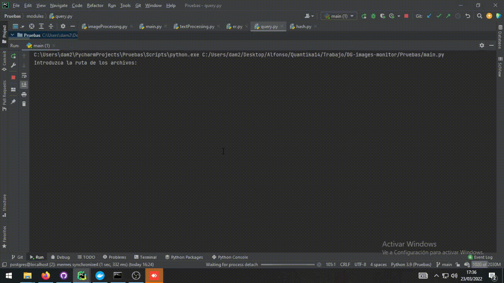
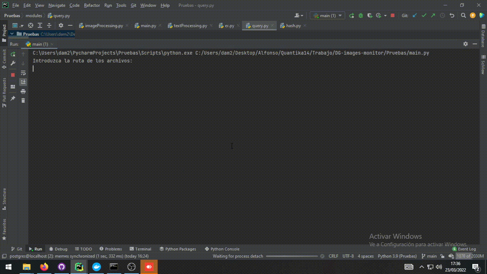

#INTELIMAGES_BOT

**INTELIMAGES_BOT** is a Telegram bot that acts as an interface between a database and the user. This bot is able to recognise text
using the OCR technology and queries the database for given words specified by the user.

##REQUIREMENTS

    ·Python 3.9
    ·CV2
    ·glob
    ·pytesseract
    ·Tesseract
    ·numpy
    

##INSTALATION

Install Tesseract-ocr and make sure that the path (path_tesseract) in var_c is the right one, on windows it should be at C:\\Program Files\\Tesseract-OCR\\tesseract.exe and on Linux it should be at /usr/share/tesseract-ocr
Run requirements.txt
If while installing requirements.txt cv2 fails run in the terminal pip install opencv-python at the project location, if stop-words fails run pip install stop-words
Create a folder called memes in the root directory

**Docker**
Mount the docker image of mongodb docker, open port 27017
Mount the docker image in the dg-ocr docker, opening the port 27017
Connect these two dockers with bridge connection.
In dg-ocr docker run main.py and select option 2.

##CONFIG

var_c is the config file of this project

#DEMO
Uploading new images:

Uploading images already present in the database:

